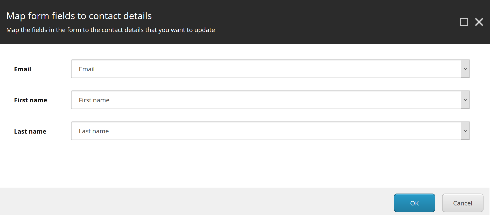

# Sc.UpdateContact

Sitecore Forms Submit action allowing to map Contact facets to form fields and update it via xConnect:

This is implementation of Update Contact submit action for Sitecore 9 Forms described in:
https://doc.sitecore.net/sitecore_experience_platform/digital_marketing/sitecore_forms/setting_up_and_configuring/walkthrough_creating_a_custom_submit_action_that_updates_contact_details#_Create_a_submit

## Installation

* In Content Management or Standalone server install [Sc.UpdateContact-1.0.zip](sc.package) using Sitecore Installation Wizard.

## Manual Installation/Install from Source

* Clone repository
* If needed update nuget packages used in Sc.UpdateContact project to match your Sitecore 9 version
* Update `publishUrl` to your Sitecore instance URL in `publishsettings.targets` file
* Update path in `SourceFolderScUpdateContact` variable to your local repository folder in `Sc.UpdateContact.DevSettings.config` file
* (Optionally) publish `Serialization` project from Visual Studio. This project contains Unicorn assemblies and configuration. If you already have Unicorn in your solution you can skip this step.
* Publish `Sc.UpdateContact` project.   
* Go to {your-sitecore-instance}/unicorn.aspx and sync `Foundation.Sc.UpdateContact` project.
